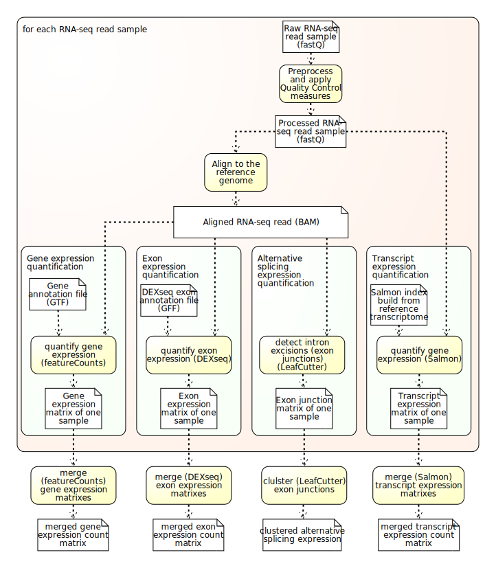

# 

### Introduction

**nfcore/rnaseq** is a bioinformatics analysis pipeline used for RNA sequencing data.

The workflow processes raw data from FastQ inputs ([FastQC](https://www.bioinformatics.babraham.ac.uk/projects/fastqc/), [Trim Galore!](https://www.bioinformatics.babraham.ac.uk/projects/trim_galore/)), aligns the reads ([STAR](https://github.com/alexdobin/STAR) or [HiSAT2](https://ccb.jhu.edu/software/hisat2/index.shtml)), generates gene counts ([featureCounts](http://bioinf.wehi.edu.au/featureCounts/), [StringTie](https://ccb.jhu.edu/software/stringtie/)) and performs extensive quality-control on the results ([RSeQC](http://rseqc.sourceforge.net/), [dupRadar](https://bioconductor.org/packages/release/bioc/html/dupRadar.html), [Preseq](http://smithlabresearch.org/software/preseq/), [edgeR](https://bioconductor.org/packages/release/bioc/html/edgeR.html), [MultiQC](http://multiqc.info/)). See the [output documentation](docs/output.md) for more details of the results.

Additionally, the pipeline is expanded to be able to quantify transcript, exon, alternative splicing and TxRevise expressions. See [optional quantification methods](docs/extra_phenotype_quantification.md) for details.

The pipeline is built using [Nextflow](https://www.nextflow.io), a bioinformatics workflow tool to run tasks across multiple compute infrastructures in a very portable manner. It comes with docker / singularity containers making installation trivial and results highly reproducible.

### Documentation
The nfcore/rnaseq pipeline comes with documentation about the pipeline, found in the `docs/` directory:

1. [Installation](docs/installation.md)
2. Pipeline configuration
    * [Local installation](docs/configuration/local.md)
    * [Amazon Web Services (aws)](docs/configuration/aws.md)
    * [Swedish UPPMAX clusters](docs/configuration/uppmax.md)
    * [Swedish cs3e Hebbe cluster](docs/configuration/c3se.md)
    * [Tübingen QBiC](docs/configuration/qbic.md)
    * [CCGA Kiel](docs/configuration/ccga.md)
    * [Adding your own system](docs/configuration/adding_your_own.md)
3. [Running the pipeline (Gene expression)](docs/usage.md)
4. [Running the pipeline (With additional quantification methods)](docs/extra_phenotype_quantification.md)
5. [Output and how to interpret the results](docs/output.md)
6. [Troubleshooting](docs/troubleshooting.md)

### General overview 
The schema shown below represents the high level structure of the pipeline.
# 

### Credits
These scripts were originally written for use at the [National Genomics Infrastructure](https://portal.scilifelab.se/genomics/), part of [SciLifeLab](http://www.scilifelab.se/) in Stockholm, Sweden, by Phil Ewels ([@ewels](https://github.com/ewels)) and Rickard Hammarén ([@Hammarn](https://github.com/Hammarn)).

Many thanks to other who have helped out along the way too, including (but not limited to):
[@Galithil](https://github.com/Galithil),
[@pditommaso](https://github.com/pditommaso),
[@orzechoj](https://github.com/orzechoj),
[@apeltzer](https://github.com/apeltzer),
[@colindaven](https://github.com/colindaven).
